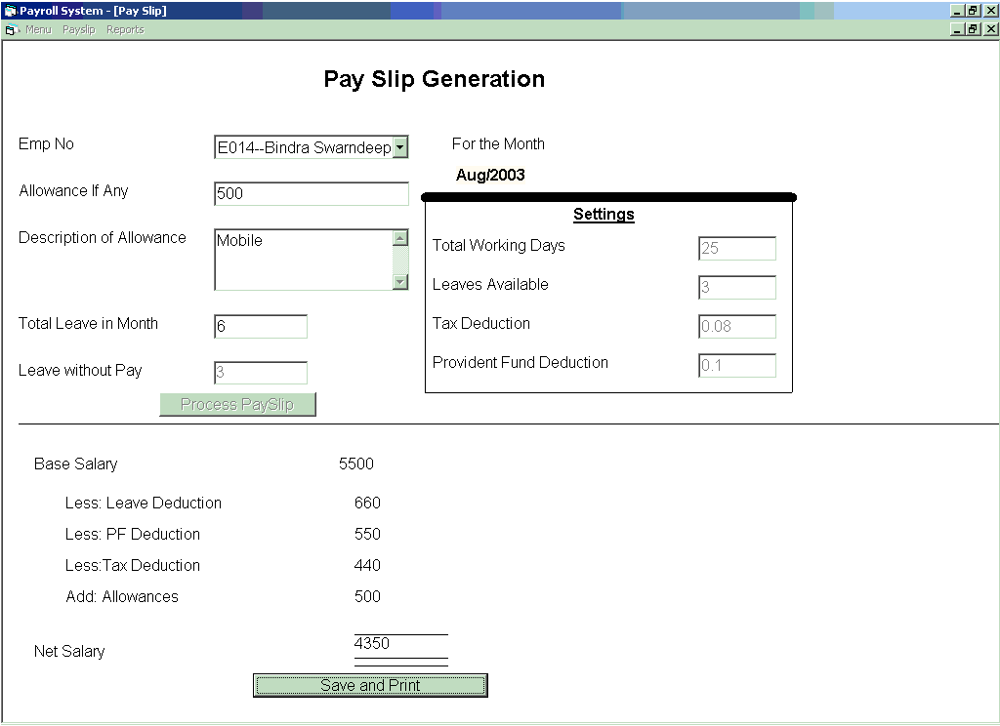



## An Excellent Payroll System

### Description

This is a payroll system, register new employees and gives them employee no, validates each & every entry. each month, operator can select the Employee ID can generate the Payslip.

This is very perfect Payroll System, you should use this, learners will found it extremely useful.
 
### More Info
 
User has to input the data in the term of employee information etc.

The general function of Payroll system.

Pay slips can be generated.

             |
---                |---
**Submitted On**   |2003-08-11 19:36:44
**By**             |[Swarndeep Singh](https://github.com/Planet-Source-Code/PSCIndex/blob/master/ByAuthor/swarndeep-singh.md)
**Level**          |Intermediate
**User Rating**    |4.2 (25 globes from 6 users)
**Compatibility**  |VB 4\.0 \(32\-bit\), VB 5\.0, VB 6\.0
**Category**       |[Databases/ Data Access/ DAO/ ADO](https://github.com/Planet-Source-Code/PSCIndex/blob/master/ByCategory/databases-data-access-dao-ado__1-6.md)
**World**          |[Visual Basic](https://github.com/Planet-Source-Code/PSCIndex/blob/master/ByWorld/visual-basic.md)
**Archive File**   |[Payroll\_Sy1633218212003\.zip](https://github.com/Planet-Source-Code/swarndeep-singh-an-excellent-payroll-system__1-47881/archive/master.zip)

